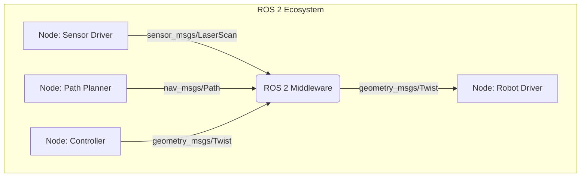

# Module 1: The Robotic Nervous System (ROS 2)

## Learning Objectives
- Understand how ROS 2 acts as the "nervous system" of humanoid robots
- Learn the fundamental communication patterns in ROS 2 (nodes, topics, services)
- Gain hands-on experience with rclpy for Python-based ROS 2 development
- Design robot behaviors as distributed systems

## Intuition

Think of ROS 2 like the nervous system of a humanoid robot. Just as your nervous system allows different parts of your body to communicate and coordinate actions, ROS 2 enables different software components of a robot to work together seamlessly. When you want to move your arm, your brain sends signals through your nervous system to the appropriate muscles. Similarly, in a robot, different software "nodes" communicate through ROS 2 to coordinate complex behaviors.

## Concept

ROS 2 (Robot Operating System 2) is middleware that provides services designed for a heterogeneous computer cluster, including hardware abstraction, device drivers, libraries, visualizers, message-passing, package management, and more. It's not an operating system but rather a collection of tools, libraries, and conventions that aim to simplify the task of creating complex and robust robot behavior across a wide variety of robot platforms and environments.

## Diagram



## Minimal Example

Here's a simple ROS 2 publisher node in Python:

```python title="minimal_publisher.py"
import rclpy
from rclpy.node import Node
from std_msgs.msg import String

class MinimalPublisher(Node):
    def __init__(self):
        super().__init__('minimal_publisher')
        self.publisher = self.create_publisher(String, 'topic', 10)
        timer_period = 0.5  # seconds
        self.timer = self.create_timer(timer_period, self.timer_callback)
        self.i = 0

    def timer_callback(self):
        msg = String()
        msg.data = f'Hello World: {self.i}'
        self.publisher.publish(msg)
        self.get_logger().info(f'Publishing: "{msg.data}"')
        self.i += 1

def main(args=None):
    rclpy.init(args=args)
    minimal_publisher = MinimalPublisher()
    rclpy.spin(minimal_publisher)
    minimal_publisher.destroy_node()
    rclpy.shutdown()

if __name__ == '__main__':
    main()
```

**Expected Output**:
```
[INFO] [1612345678.123456789] [minimal_publisher]: Publishing: "Hello World: 0"
[INFO] [1612345678.623456789] [minimal_publisher]: Publishing: "Hello World: 1"
```

## Exercises

1. Create a subscriber node that listens to the "topic" and logs the received messages
2. Modify the publisher to send different types of messages (integers, custom messages)
3. Create a service client and server pair that performs a simple calculation

## Summary

ROS 2 provides the communication infrastructure that allows different parts of a robot system to work together. In the next sections, we'll explore each communication pattern in detail and learn how to implement them effectively for humanoid robot control.