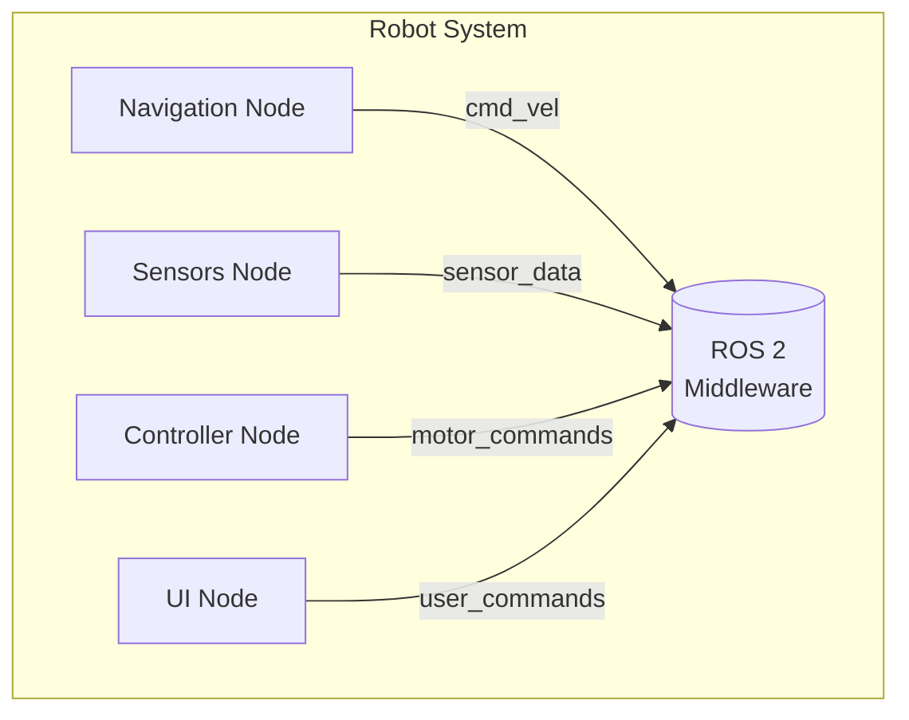

# ROS 2 Nodes

## Learning Objectives
- Understand what a ROS 2 node is and its role in the system
- Learn how to create and structure ROS 2 nodes in Python
- Understand node lifecycle and management
- Practice creating custom nodes for humanoid robot control

## Intuition

A ROS 2 node is like a specialized brain cell or function within the robot's nervous system. Just as different neurons in your brain have specialized functions (some process visual information, others control movement), different nodes in a robot system have specialized functions (some handle sensor data, others control actuators). Nodes are the fundamental building blocks of any ROS 2 application.

## Concept

A node is an executable that uses ROS 2 client library to communicate with other nodes. Nodes can publish or subscribe to messages, provide or use services, and have parameters. All the ROS graph concepts (nodes, topics, services, parameters, actions) are available within a node. Nodes are the processes that perform computation and communication in a ROS 2 system.

## Diagram



## Minimal Example

Here's how to create a simple ROS 2 node that represents a humanoid joint controller:

```python title="joint_controller_node.py"
import rclpy
from rclpy.node import Node
from sensor_msgs.msg import JointState
from std_msgs.msg import Float64MultiArray

class JointControllerNode(Node):
    def __init__(self):
        super().__init__('joint_controller')

        # Subscribe to joint state messages
        self.subscription = self.create_subscription(
            JointState,
            'joint_states',
            self.listener_callback,
            10)

        # Publish desired joint positions
        self.publisher = self.create_publisher(
            Float64MultiArray,
            'joint_position_commands',
            10)

        # Timer for control loop
        self.timer = self.create_timer(0.1, self.control_loop)

        self.get_logger().info('Joint Controller Node initialized')

    def listener_callback(self, msg):
        self.get_logger().info(f'Received joint states: {msg.name}')

    def control_loop(self):
        # In a real implementation, this would contain control logic
        msg = Float64MultiArray()
        msg.data = [0.0, 0.0, 0.0]  # Default joint positions
        self.publisher.publish(msg)

def main(args=None):
    rclpy.init(args=args)
    node = JointControllerNode()

    try:
        rclpy.spin(node)
    except KeyboardInterrupt:
        pass
    finally:
        node.destroy_node()
        rclpy.shutdown()

if __name__ == '__main__':
    main()
```

**Expected Output**:
```
[INFO] [1612345678.123456789] [joint_controller]: Joint Controller Node initialized
[INFO] [1612345678.223456789] [joint_controller]: Received joint states: ['hip_joint', 'knee_joint', 'ankle_joint']
```

## Exercises

1. Create a node that simulates a humanoid head controller with pan and tilt joints
2. Implement a node that monitors multiple joint states and logs when they exceed safe limits
3. Create a node that coordinates between multiple joint controllers for walking gait

## Summary

Nodes are the fundamental building blocks of ROS 2 systems. In humanoid robotics, each node typically handles a specific aspect of robot control or sensing. Understanding how to structure and implement nodes is crucial for creating robust robot applications.