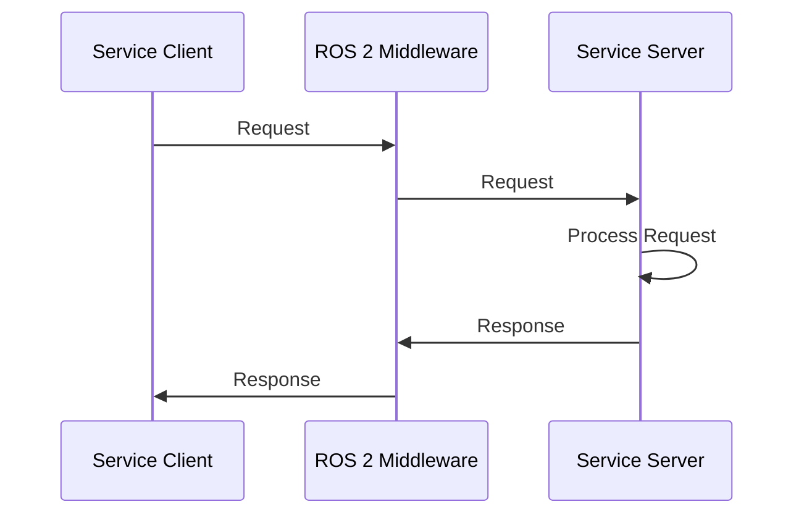

# ROS 2 Services

## Learning Objectives
- Understand the request-response communication pattern in ROS 2
- Learn how to create and use services for synchronous robot operations
- Compare when to use services vs. topics for different use cases
- Implement services for humanoid robot operations

## Intuition

Services in ROS 2 are like asking a specific question and waiting for a specific answer. Unlike topics which broadcast continuously, services work like a synchronous conversation where one node asks another node to perform a specific task and waits for the result. For example, you might use a service to ask a navigation system to plan a path from point A to point B and wait for the complete path before proceeding.

## Concept

Services implement a one-to-one, synchronous, buffered, connection-based, and reliable communication pattern. A service client sends a request to a service server, which processes the request and sends back a response. The client waits for the response before continuing execution. Services are defined by `.srv` files that specify the request and response message types.

## Diagram



## Minimal Example

Here's an example of a service for humanoid robot joint calibration:

```python title="joint_calibration.srv"
# Request
string joint_name
float64 target_position
---
# Response
bool success
string message
```

```python title="calibration_server.py"
import rclpy
from rclpy.node import Node
from example_interfaces.srv import Trigger  # Using built-in service for simplicity
# In real implementation, you'd use a custom service defined in joint_calibration.srv

class CalibrationServer(Node):
    def __init__(self):
        super().__init__('calibration_server')
        self.srv = self.create_service(
            Trigger,  # In practice, use custom service type
            'calibrate_joint',
            self.calibrate_joint_callback)

    def calibrate_joint_callback(self, request, response):
        self.get_logger().info('Calibrating joint...')

        # Simulate calibration process
        # In a real implementation, this would interact with hardware
        success = True  # Simulate successful calibration

        response.success = success
        if success:
            response.message = 'Joint calibrated successfully'
        else:
            response.message = 'Calibration failed'

        return response

def main(args=None):
    rclpy.init(args=args)
    server = CalibrationServer()

    try:
        rclpy.spin(server)
    except KeyboardInterrupt:
        pass
    finally:
        server.destroy_node()
        rclpy.shutdown()

if __name__ == '__main__':
    main()
```

```python title="calibration_client.py"
import rclpy
from rclpy.node import Node
from example_interfaces.srv import Trigger

class CalibrationClient(Node):
    def __init__(self):
        super().__init__('calibration_client')
        self.cli = self.create_client(Trigger, 'calibrate_joint')
        while not self.cli.wait_for_service(timeout_sec=1.0):
            self.get_logger().info('Service not available, waiting again...')
        self.req = Trigger.Request()

    def send_request(self):
        self.future = self.cli.call_async(self.req)
        rclpy.spin_until_future_complete(self, self.future)
        return self.future.result()

def main(args=None):
    rclpy.init(args=args)
    client = CalibrationClient()
    response = client.send_request()

    if response:
        client.get_logger().info(f'Result: {response.success}, {response.message}')
    else:
        client.get_logger().info('Service call failed')

    client.destroy_node()
    rclpy.shutdown()

if __name__ == '__main__':
    main()
```

## When to Use Services vs. Topics

| Use Services When | Use Topics When |
|-------------------|-----------------|
| Need guaranteed delivery | Broadcasting continuous data |
| Require response/confirmation | One-to-many communication |
| Operation has clear start/end | Asynchronous communication |
| Need error handling in response | Real-time streaming |
| Synchronous operation | No response needed |

## Common Service Patterns in Humanoid Robotics

1. **Calibration Services**: Calibrate sensors, joints, or entire robot
2. **Configuration Services**: Change robot parameters or modes
3. **Safety Services**: Enable/disable safety systems, emergency stop
4. **Utility Services**: Save/load configurations, system diagnostics

## Exercises

1. Create a service that calculates inverse kinematics for a humanoid arm
2. Implement a service for switching between walking and standing modes
3. Design a service architecture for humanoid robot autonomous recovery

## Summary

Services provide synchronous request-response communication that's essential for operations that require confirmation or have a clear start/end state. In humanoid robotics, services are crucial for calibration, configuration, and safety operations.