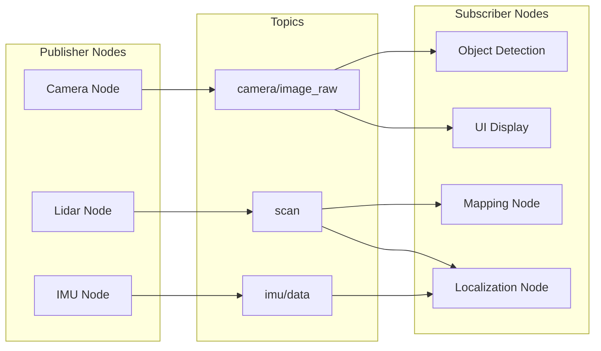

# ROS 2 Topics

## Learning Objectives
- Understand the publish-subscribe communication pattern in ROS 2
- Learn how to create publishers and subscribers for robot data streams
- Understand quality of service (QoS) settings for different use cases
- Apply topics to humanoid robot sensor and control data streams

## Intuition

Topics in ROS 2 are like radio stations that broadcast information continuously. Any node can "tune in" to a topic to receive the information being broadcast, and any node can broadcast information to a topic for others to receive. For example, a camera node might continuously broadcast images on a "camera/image" topic, and multiple nodes (object detection, navigation, UI) might all listen to that same stream of images.

## Concept

Topics implement a one-to-many, asynchronous, non-buffered, connectionless, and unreliable communication pattern. Publishers send messages to a topic without knowledge of subscribers, and subscribers receive messages without knowledge of publishers. The ROS 2 middleware handles the routing between publishers and subscribers based on topic names.

## Diagram



## Minimal Example

Here's an example of a publisher-subscriber pair for humanoid robot sensor data:

```python title="sensor_publisher.py"
import rclpy
from rclpy.node import Node
from sensor_msgs.msg import JointState
import math
import time

class SensorPublisher(Node):
    def __init__(self):
        super().__init__('sensor_publisher')
        self.publisher = self.create_publisher(JointState, 'joint_states', 10)
        self.timer = self.create_timer(0.1, self.publish_sensor_data)
        self.i = 0

    def publish_sensor_data(self):
        msg = JointState()
        msg.name = ['hip_joint', 'knee_joint', 'ankle_joint']
        # Simulate oscillating joint positions
        msg.position = [
            math.sin(self.i * 0.1),
            math.cos(self.i * 0.1) * 0.5,
            math.sin(self.i * 0.1 + 0.5)
        ]
        msg.header.stamp = self.get_clock().now().to_msg()
        self.publisher.publish(msg)
        self.get_logger().info(f'Published joint states: {msg.position}')
        self.i += 1

def main(args=None):
    rclpy.init(args=args)
    publisher = SensorPublisher()

    try:
        rclpy.spin(publisher)
    except KeyboardInterrupt:
        pass
    finally:
        publisher.destroy_node()
        rclpy.shutdown()

if __name__ == '__main__':
    main()
```

```python title="sensor_subscriber.py"
import rclpy
from rclpy.node import Node
from sensor_msgs.msg import JointState

class SensorSubscriber(Node):
    def __init__(self):
        super().__init__('sensor_subscriber')
        self.subscription = self.create_subscription(
            JointState,
            'joint_states',
            self.listener_callback,
            10)
        self.subscription  # prevent unused variable warning

    def listener_callback(self, msg):
        self.get_logger().info(f'Received joint positions: {msg.position}')
        # In a real system, you might process this data for control or monitoring

def main(args=None):
    rclpy.init(args=args)
    subscriber = SensorSubscriber()

    try:
        rclpy.spin(subscriber)
    except KeyboardInterrupt:
        pass
    finally:
        subscriber.destroy_node()
        rclpy.shutdown()

if __name__ == '__main__':
    main()
```

## Quality of Service (QoS) Settings

For humanoid robotics applications, consider these QoS profiles:

```python
from rclpy.qos import QoSProfile, ReliabilityPolicy, DurabilityPolicy

# For critical sensor data (e.g., IMU, joint states)
sensor_qos = QoSProfile(
    depth=10,
    reliability=ReliabilityPolicy.RELIABLE,
    durability=DurabilityPolicy.VOLATILE
)

# For less critical data (e.g., diagnostics, logs)
diagnostic_qos = QoSProfile(
    depth=1,
    reliability=ReliabilityPolicy.BEST_EFFORT,
    durability=DurabilityPolicy.VOLATILE
)
```

## Exercises

1. Create a topic that broadcasts the humanoid's center of mass position for balance monitoring
2. Implement a low-pass filter subscriber that smooths noisy sensor data
3. Design a topic architecture for a humanoid's full body sensor system

## Summary

Topics provide the asynchronous communication backbone for robot systems. In humanoid robotics, topics are essential for streaming sensor data, broadcasting control commands, and sharing state information between different system components.