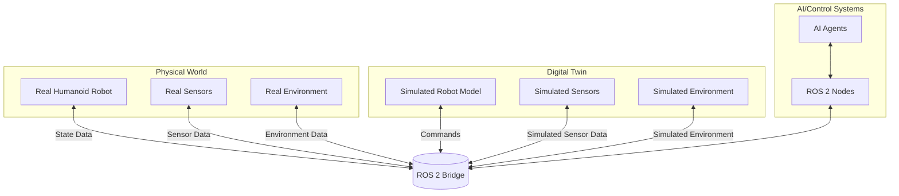

# Module 2: The Digital Twin (Gazebo & Unity)

## Learning Objectives
- Understand the concept of digital twins in robotics
- Learn to configure and operate Gazebo for physics simulation
- Gain experience with Unity for high-fidelity rendering
- Connect simulation environments to ROS 2 via bridges
- Validate robot behaviors in simulation before real-world deployment

## Intuition

A digital twin is like having a virtual copy of your robot that lives in the computer. Just as pilots train in flight simulators before flying real aircraft, roboticists test and validate their robot behaviors in digital twins before deploying to real robots. The digital twin allows you to experiment, iterate, and debug without the risks and costs associated with real hardware.

## Concept

A digital twin in robotics is a virtual representation of a physical robot that mirrors its properties, behaviors, and environment. It includes:
- **Physical Model**: Accurate representation of the robot's kinematics and dynamics
- **Behavioral Model**: Simulation of the robot's control systems and responses
- **Environmental Model**: Representation of the robot's operating environment
- **Data Flow**: Bidirectional communication between physical and virtual systems

## Diagram



## Digital Twin Benefits

1. **Safety**: Test dangerous behaviors in simulation first
2. **Cost-Effective**: Reduce wear on real hardware
3. **Rapid Iteration**: Faster development cycles
4. **Data Generation**: Create large datasets for AI training
5. **Risk Mitigation**: Identify issues before real-world deployment

## Gazebo vs. Unity

| Aspect | Gazebo | Unity |
|--------|--------|-------|
| Primary Focus | Physics Simulation | Visual Fidelity |
| Realism | High physical accuracy | High visual quality |
| Use Case | Control algorithm testing | Human-robot interaction |
| Performance | Optimized for physics | Optimized for graphics |
| Integration | Native ROS support | Requires bridge plugins |

## Minimal Example

Here's how to connect a simple controller to a simulated robot:

```python title="simulation_controller.py"
import rclpy
from rclpy.node import Node
from sensor_msgs.msg import JointState
from geometry_msgs.msg import Twist
import time

class SimulationController(Node):
    def __init__(self):
        super().__init__('simulation_controller')

        # Publishers for simulation commands
        self.joint_pub = self.create_publisher(JointState, 'joint_commands', 10)
        self.cmd_vel_pub = self.create_publisher(Twist, 'cmd_vel', 10)

        # Subscribers for simulation feedback
        self.joint_sub = self.create_subscription(
            JointState, 'joint_states', self.joint_callback, 10)
        self.odom_sub = self.create_subscription(
            Odometry, 'odom', self.odom_callback, 10)

        # Control timer
        self.timer = self.create_timer(0.05, self.control_loop)

        self.get_logger().info('Simulation Controller initialized')

    def joint_callback(self, msg):
        # Process joint state from simulation
        self.get_logger().debug(f'Received {len(msg.name)} joints from simulation')

    def odom_callback(self, msg):
        # Process odometry from simulation
        self.get_logger().debug(f'Robot position: {msg.pose.pose.position}')

    def control_loop(self):
        # Implement control logic for simulation
        # This would typically include path planning, balance control, etc.
        pass

def main(args=None):
    rclpy.init(args=args)
    controller = SimulationController()

    try:
        rclpy.spin(controller)
    except KeyboardInterrupt:
        pass
    finally:
        controller.destroy_node()
        rclpy.shutdown()

if __name__ == '__main__':
    main()
```

## Sim-to-Real Transfer Considerations

When moving from simulation to real robots, consider:
- **Reality Gap**: Differences between simulated and real physics
- **Sensor Noise**: Real sensors have noise and delays not present in simulation
- **Model Accuracy**: How well the simulation matches the real robot
- **Environmental Factors**: Real-world unpredictability

## Exercises

1. Set up a basic Gazebo simulation with a simple robot model
2. Create a Unity scene with a humanoid robot and basic environment
3. Implement a controller that works in both simulation and with real hardware parameters

## Summary

Digital twins are essential tools in modern robotics development, providing safe and cost-effective environments for testing and validation. Understanding both physics simulation (Gazebo) and high-fidelity rendering (Unity) will enable you to create comprehensive digital twins for humanoid robots.