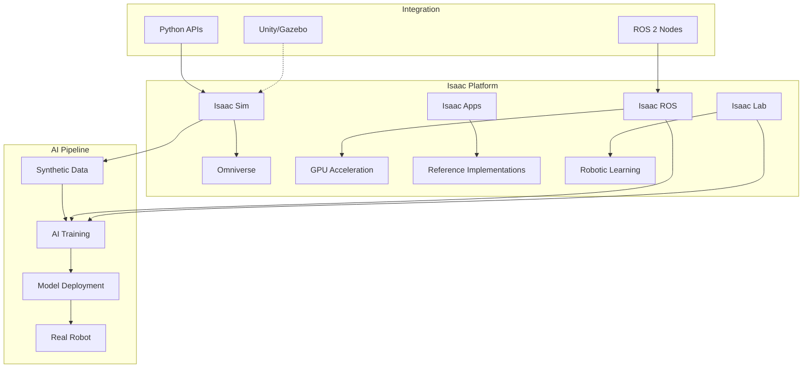

# Module 3: NVIDIA Isaac & Advanced Simulation

## Learning Objectives
- Understand NVIDIA Isaac as a comprehensive robotics development platform
- Learn to use Isaac Sim for advanced physics simulation and AI training
- Gain experience with Isaac ROS for GPU-accelerated perception and navigation
- Integrate Isaac tools with existing ROS 2 workflows
- Leverage GPU acceleration for complex humanoid robot tasks

## Intuition

NVIDIA Isaac is like having a supercharged laboratory for robotics development, where the power of GPUs accelerates both simulation and AI processing. Think of it as a specialized environment designed specifically for creating, testing, and deploying intelligent robotic systems. Just as graphic designers use powerful workstations to render complex visual effects, roboticists use Isaac to simulate complex robot behaviors and train AI systems with photorealistic environments and physics.

## Concept

NVIDIA Isaac is a comprehensive robotics platform that includes:
- **Isaac Sim**: Advanced simulation environment built on NVIDIA Omniverse
- **Isaac ROS**: GPU-accelerated perception and navigation packages
- **Isaac Apps**: Reference applications and demonstrations
- **Isaac Lab**: Framework for robotic learning and simulation

For humanoid robotics, Isaac provides:
- Physically accurate simulation with GPU acceleration
- Photorealistic rendering for computer vision training
- High-fidelity sensor simulation
- Integration with NVIDIA's AI and simulation technologies

## Diagram



## Isaac Sim Architecture

Isaac Sim is built on NVIDIA Omniverse, providing:

### 1. USD-Based Scene Description
```python title="usd_scene_example.py"
# Example of creating a USD scene in Isaac Sim
from omni.isaac.core.utils.stage import add_reference_to_stage
from omni.isaac.core.utils.nucleus import get_assets_root_path
from omni.isaac.core import World

# Create world instance
world = World(stage_units_in_meters=1.0)

# Add robot from Isaac Sim assets
assets_root_path = get_assets_root_path()
if assets_root_path is not None:
    add_reference_to_stage(
        usd_path=f"{assets_root_path}/Isaac/Robots/Franka/franka.usd",
        prim_path="/World/Franka"
    )

# Add ground plane and objects
world.scene.add_default_ground_plane()
```

### 2. Physics Simulation with PhysX
Isaac Sim uses NVIDIA PhysX for accurate physics simulation, which is particularly beneficial for humanoid robots requiring precise contact modeling and balance control.

### 3. RTX Rendering
The platform provides photorealistic rendering capabilities essential for synthetic data generation and computer vision training.

## Isaac ROS Packages

Isaac ROS provides GPU-accelerated packages for robotics applications:

### 1. Perception Acceleration
```python title="isaac_ros_perception.py"
import rclpy
from rclpy.node import Node
from sensor_msgs.msg import Image
from stereo_msgs.msg import DisparityImage
from vision_msgs.msg import Detection2DArray

class IsaacROSPerceptionNode(Node):
    def __init__(self):
        super().__init__('isaac_ros_perception')

        # Publishers for GPU-accelerated processing
        self.stereo_sub = self.create_subscription(
            Image, 'stereo/left/image_rect_color',
            self.stereo_callback, 10)

        self.detection_pub = self.create_publisher(
            Detection2DArray, 'isaac_ros/detections', 10)

    def stereo_callback(self, msg):
        """
        Process stereo image with GPU acceleration
        Isaac ROS provides packages like:
        - Isaac ROS Stereo DNN
        - Isaac ROS Stereo Disparity
        - Isaac ROS AprilTag
        """
        # GPU-accelerated stereo processing
        # This would use Isaac ROS stereo packages
        pass

def main(args=None):
    rclpy.init(args=args)
    node = IsaacROSPerceptionNode()
    rclpy.spin(node)
    node.destroy_node()
    rclpy.shutdown()

if __name__ == '__main__':
    main()
```

### 2. Common Isaac ROS Packages:
- **isaac_ros_stereo_dnn**: Real-time stereo DNN inference
- **isaac_ros_detectnet**: Object detection with GPU acceleration
- **isaac_ros_pose_estimation**: 6-DOF pose estimation
- **isaac_ros_point_cloud_interfaces**: GPU-accelerated point cloud processing

## Isaac Sim Configuration for Humanoid Robots

Here's an example configuration for simulating a humanoid robot:

```python title="humanoid_isaac_sim.py"
import omni
from omni.isaac.core import World
from omni.isaac.core.utils.stage import add_reference_to_stage
from omni.isaac.core.utils.prims import get_prim_at_path
from omni.isaac.core.utils.nucleus import get_assets_root_path
import numpy as np

class HumanoidIsaacSim:
    def __init__(self):
        self.world = World(stage_units_in_meters=1.0)
        self.setup_environment()
        self.load_humanoid_robot()

    def setup_environment(self):
        """Setup simulation environment"""
        # Add ground plane
        self.world.scene.add_default_ground_plane()

        # Add lighting
        from omni.isaac.core.utils.prims import create_prim
        create_prim("/World/Light", "SphereLight", position=np.array([0, 0, 10]))

        # Add textured ground
        from omni.isaac.core.objects import VisualMaterial
        material = VisualMaterial(
            prim_path="/World/GroundMaterial",
            diffuse_color=np.array([0.2, 0.2, 0.2]),
            roughness=0.8,
            metallic=0.0
        )

    def load_humanoid_robot(self):
        """Load humanoid robot model"""
        assets_root_path = get_assets_root_path()
        if assets_root_path is not None:
            # Load a humanoid robot model
            # In practice, this would be a more complex humanoid model
            add_reference_to_stage(
                usd_path=f"{assets_root_path}/Isaac/Props/KIT/processed_819/10029_Toy_Figure_Soldier.usd",
                prim_path="/World/Humanoid"
            )
        else:
            # Fallback: create a simple articulated robot
            self.create_simple_humanoid()

    def create_simple_humanoid(self):
        """Create a simple humanoid model if assets not available"""
        # This would involve creating a basic humanoid with joints
        # using Isaac's articulation tools
        pass

    def run_simulation(self):
        """Run the simulation"""
        self.world.reset()
        for i in range(1000):  # Run for 1000 steps
            self.world.step(render=True)

            if i % 100 == 0:
                # Print robot position
                robot_pos, robot_ori = self.world.get_robot_position_orientation()
                print(f"Step {i}, Position: {robot_pos}")

# Example usage
if __name__ == "__main__":
    sim = HumanoidIsaacSim()
    sim.run_simulation()
```

## Domain Randomization

Isaac Sim excels at domain randomization for robust AI training:

```python title="domain_randomization.py"
import numpy as np
from omni.isaac.core.utils.prims import get_prim_at_path
from pxr import Gf

class DomainRandomization:
    def __init__(self, sim_world):
        self.world = sim_world
        self.randomization_params = {
            'lighting': {'intensity_range': [0.5, 2.0], 'color_range': [0.8, 1.2]},
            'textures': {'roughness_range': [0.1, 0.9], 'metallic_range': [0.0, 0.5]},
            'physics': {'friction_range': [0.3, 0.9], 'restitution_range': [0.0, 0.2]}
        }

    def randomize_lighting(self):
        """Randomize lighting conditions"""
        light_prim = get_prim_at_path("/World/Light")
        if light_prim:
            # Randomize intensity
            intensity = np.random.uniform(
                self.randomization_params['lighting']['intensity_range'][0],
                self.randomization_params['lighting']['intensity_range'][1]
            )
            light_prim.GetAttribute("inputs:intensity").Set(intensity)

            # Randomize color temperature
            color_scale = np.random.uniform(
                self.randomization_params['lighting']['color_range'][0],
                self.randomization_params['lighting']['color_range'][1],
                size=3
            )
            light_prim.GetAttribute("inputs:color").Set(Gf.Vec3f(*color_scale))

    def randomize_materials(self):
        """Randomize material properties"""
        # Apply random material properties to objects
        # This makes the training more robust to real-world variations
        pass

    def randomize_physics(self):
        """Randomize physics properties"""
        # Randomize friction and restitution coefficients
        # This helps the robot adapt to different surface conditions
        pass
```

## Integration with Existing ROS 2 Workflows

Isaac can be integrated with existing ROS 2 systems:

```python title="isaac_ros_integration.py"
import rclpy
from rclpy.node import Node
from sensor_msgs.msg import JointState, Imu
from geometry_msgs.msg import Twist
from std_msgs.msg import String

class IsaacROSIntegrationNode(Node):
    def __init__(self):
        super().__init__('isaac_ros_integration')

        # Publishers to Isaac Sim
        self.joint_cmd_pub = self.create_publisher(JointState, '/isaac/joint_commands', 10)
        self.cmd_vel_pub = self.create_publisher(Twist, '/isaac/cmd_vel', 10)

        # Subscribers from Isaac Sim
        self.joint_state_sub = self.create_subscription(
            JointState, '/isaac/joint_states', self.joint_state_callback, 10)
        self.imu_sub = self.create_subscription(
            Imu, '/isaac/imu', self.imu_callback, 10)

        # Timer for control loop
        self.control_timer = self.create_timer(0.05, self.control_loop)

        self.get_logger().info('Isaac ROS Integration Node started')

    def joint_state_callback(self, msg):
        """Process joint states from Isaac Sim"""
        # Process joint states received from Isaac simulation
        self.get_logger().debug(f'Received {len(msg.position)} joint positions')

    def imu_callback(self, msg):
        """Process IMU data from Isaac Sim"""
        # Process IMU data for balance control, etc.
        pass

    def control_loop(self):
        """Main control loop"""
        # Send commands to Isaac Sim
        # This would contain your control algorithms
        pass

def main(args=None):
    rclpy.init(args=args)
    node = IsaacROSIntegrationNode()
    rclpy.spin(node)
    node.destroy_node()
    rclpy.shutdown()

if __name__ == '__main__':
    main()
```

## Advanced Features

### 1. Synthetic Data Generation
Isaac Sim can generate large datasets for AI training with perfect ground truth annotations.

### 2. Multi-Robot Simulation
Simulate multiple robots interacting in the same environment.

### 3. Real-time Performance
Leverage GPU acceleration for real-time simulation of complex scenarios.

## Exercises

1. Set up a basic Isaac Sim environment with a humanoid robot model
2. Implement GPU-accelerated perception pipeline using Isaac ROS
3. Create a domain randomization scenario for robust humanoid walking

## Summary

NVIDIA Isaac provides a powerful platform for advanced robotics simulation and AI development. With its GPU-accelerated simulation, photorealistic rendering, and tight ROS 2 integration, Isaac enables the development of sophisticated humanoid robot systems with capabilities that were previously impossible to achieve in simulation. Understanding Isaac's architecture and integration patterns is crucial for leveraging its full potential in humanoid robotics.